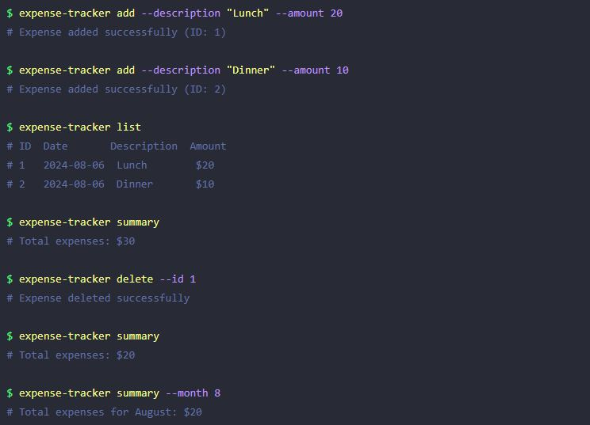

# Expense Tracker

Build a simple expense tracker to manage your finances.

### Requirements

Application should run from the command line and should have the following features:

- Users can add an expense with a description and amount.
- Users can update an expense.
- Users can delete an expense.
- Users can view all expenses.
- Users can view a summary of all expenses.
- Users can view a summary of expenses for a specific month (of current year).

Here are some additional features that you can add to the application:

- Add expense categories and allow users to filter expenses by category.
- Allow users to set a budget for each month and show a warning when the user exceeds the budget.
- Allow users to export expenses to a CSV file.

### Implementation

You can implement the application using any programming language of your choice. Here are some suggestions:

- Use any programming language for any available module for parsing command arguments (e.g. python with the argparse, node.js with commander etc).
- Use a simple text file to store the expenses data. You can use JSON, CSV, or any other format to store the data.
- Add error handling to handle invalid inputs and edge cases (e.g. negative amounts, non-existent expense IDs, etc).
- Use functions to modularize the code and make it easier to test and maintain.

# roadmap.sh

Project Page URL : [Expense Tracker](https://roadmap.sh/projects/expense-tracker)

Project Solution URL : [Expense Tracker](https://roadmap.sh/projects/expense-tracker/solutions?u=6479cefec4ec366ad5b78274)
